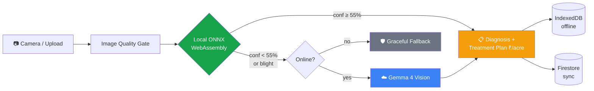
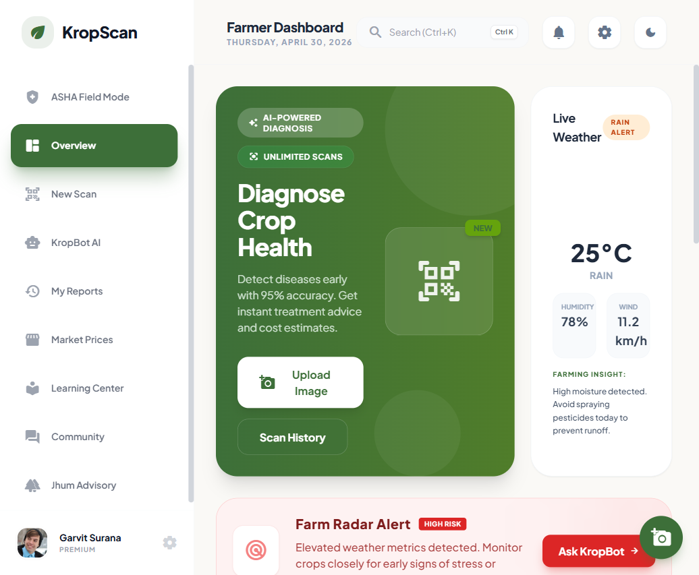
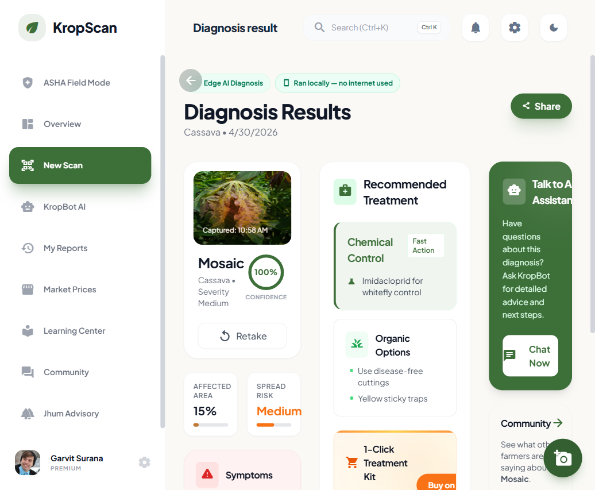
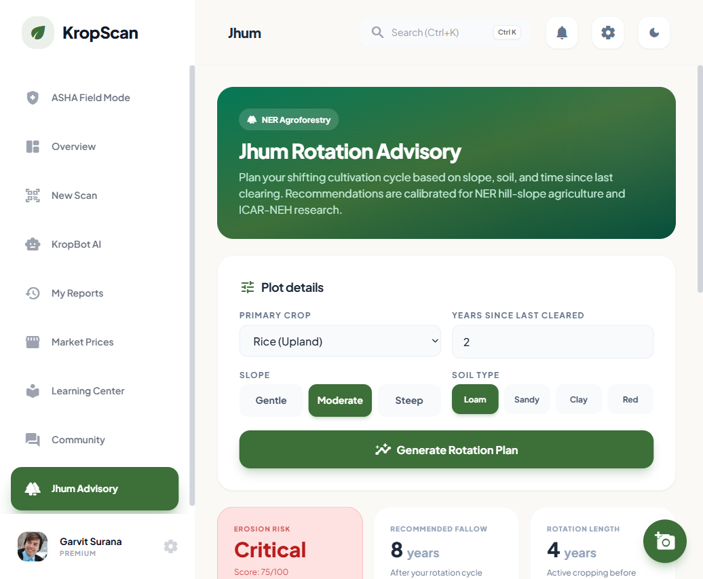
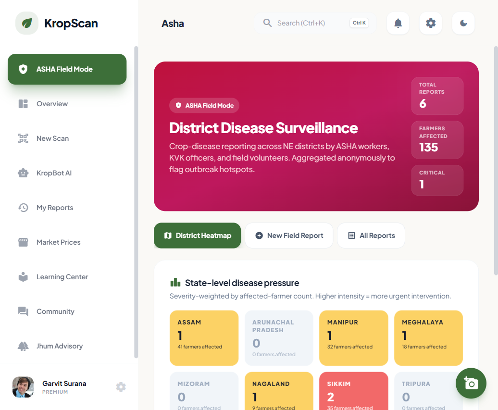

<div align="center">

# 🌱 KropScan NER

### HackDays 4.0 Hackathon Submission · Gauhati University

**Track #2 Agriculture, FoodTech & Rural Development**
**Problem Statement 2.5: AI-Based Crop Recommendation and Advisory System for Marginal Farmers**

[](https://gauhati.ac.in)
[](#)
[](https://react.dev)
[](https://www.typescriptlang.org)
[](https://onnxruntime.ai)
[](https://ai.google.dev/gemma)
[](LICENSE)

*Hybrid offline-first AI for crop disease detection + jhum rotation advisory + ASHA district surveillance, built for the marginal North-East Indian farmer.*

</div>

---

## 🎯 The problem we're solving

> *"Plantix doesn't work in our village. By the time I get to a market with internet, the leaf is already dead."*
> — common refrain from NER smallholders

The HackDays 4.0 problem statement asks for **"highly localized, weather-responsive, and data-driven advisory services"** for marginal NER farmers. Existing solutions fail because:

- **Cloud-only competitors break in NER villages** with intermittent connectivity
- **Zero existing apps cover NER specialty crops** like areca nut, large cardamom, king chilli, Khasi mandarin
- **No advisory layer for jhum (shifting cultivation)** — cycles have shrunk from 15+ years to <5, causing widespread soil erosion
- **No surveillance tier** for ASHA workers and KVK officers to spot outbreaks before they spread farm-to-farm

## 💡 Our solution

A **three-tier hybrid AI** that works offline-first and gracefully escalates to cloud:



Plus three NE-region-specific layers on top:

| Feature | What it does |
|---|---|
| 🌾 **Jhum Rotation Advisory** | Slope/soil-aware shifting cultivation planner with erosion risk scoring, calibrated to ICAR-NEH research, augmented by AI agronomist insights |
| 🏥 **ASHA Field Mode** | District-level disease surveillance with severity-weighted heatmap across 8 NE states. ASHA workers / KVK officers submit anonymized field reports |
| 🗣️ **15 languages** | 11 major Indian languages + 4 NE tribal languages (Bodo, Mizo, Khasi, Manipuri / Meitei). Auto-translated and cached for instant subsequent loads |

## 📸 Screenshots

<table>
<tr>
<td width="50%"><b>Dashboard with NER tools</b><br/></td>
<td width="50%"><b>Diagnosis result + treatment plan</b><br/></td>
</tr>
<tr>
<td width="50%"><b>Jhum rotation advisory</b><br/></td>
<td width="50%"><b>ASHA district disease heatmap</b><br/></td>
</tr>
</table>

## 🛠️ Tech stack

**Frontend** · React 19 · TypeScript 5.8 · Vite 6 · Tailwind CSS 3 · Capacitor 8 · Recharts

**AI / ML** · ONNX Runtime Web (WebAssembly) · EfficientNetV2-S (40-class classifier) · Google Gemma 4 31B · Gemini 2.5 Flash

**Auth / Data** · Firebase Phone OTP · Firestore real-time DB · IndexedDB · Workbox Service Worker

**Native** · Capacitor wrapper produces installable Android APK

## 🌟 What's new for HackDays 4.0

This submission specifically extends KropScan with NE-region-specific capabilities:

- ➕ **23 new disease entries** for 10 NER specialty crops in [`data/diseases.json`](data/diseases.json) (id 38–62)
- ➕ **NER crop morphology section** in the Gemma vision prompt ([`services/GeminiService.ts`](services/GeminiService.ts)) so the cloud model can identify crops the local ONNX never saw
- 🌾 **Jhum Rotation Advisory page** ([`pages/JhumAdvisory.tsx`](pages/JhumAdvisory.tsx)) — calibrated to ICAR-NEH research with rule-based + AI hybrid output
- 🏥 **ASHA Field Mode page** ([`pages/AshaReport.tsx`](pages/AshaReport.tsx)) with severity-weighted state heatmap
- 🗣️ **4 NE tribal languages** added with runtime auto-translation via Gemini 2.5 Flash (`thinkingBudget: 0` for low latency)

## 🚀 Run it locally

**Prerequisites:** Node.js 18+, a Gemini API key from [Google AI Studio](https://aistudio.google.com/), and the trained ONNX model file (see note below).

```bash
git clone https://github.com/garvitsurana271/kropscan.git
cd kropscan
npm install

# Configure your API keys
cp .env.example .env.local
# edit .env.local — at minimum set VITE_GEMINI_API_KEY

# Place the model file at public/models/plant_disease_model.onnx
# (see public/models/README.md for instructions)

npm run dev
# opens http://localhost:5173
```

Login uses phone OTP — in dev mode the OTP is logged to the browser console.

> **Note on the model file:** the trained ONNX model (~78 MB) is proprietary and not included in this public repository. Live demo is performed from the author's machine. Contact `dev@409.ai` to request evaluation access.

## 🎬 Demo flow (3 minutes)

1. **Scan a leaf** → local ONNX returns instant diagnosis. For NER specialty crops, hybrid pipeline silently escalates to Gemma. Pull WiFi cable mid-scan to demonstrate offline capability.
2. **Open Jhum Advisory** → enter plot details → instant rotation plan with erosion risk score + AI agronomist insights.
3. **Activate ASHA mode** → district disease heatmap loads with seeded NER reports across 8 NE states.
4. **Switch to Bodo** → UI flips to Bodo Devanagari script in ~30 seconds; cached forever after.

## 📁 Project structure

```
kropscan/
├── App.tsx                  Root component + routing
├── pages/                   21 screens — scan, dashboard, jhum, asha, etc.
├── components/              Sidebar, Header, modals
├── services/                ← read this first
│   ├── ClassifierService.ts   Hybrid AI orchestration
│   ├── TFService.ts           ONNX runtime wrapper
│   ├── GeminiService.ts       Cloud vision + translation
│   └── FirebaseService.ts     Auth + Firestore
├── data/diseases.json       63 disease entries with ₹/acre treatments
├── public/models/           81MB ONNX model + class indices
├── utils/                   Image quality, runtime translations
├── scripts/                 Python ML training pipeline
└── docs/
    ├── ARCHITECTURE.md      Full technical breakdown
    └── screenshots/
```

For the full technical deep-dive, see [`docs/ARCHITECTURE.md`](docs/ARCHITECTURE.md).

## 👥 Team

| Name | Role |
|---|---|
| Garvit Surana | Full-stack + AI integration |
| [Teammate Name] | [Role] |

College: [Your College Name]

Contact: **dev@409.ai**

## 📜 License

Proprietary, all rights reserved. See [LICENSE](LICENSE).

This source is provided for review and evaluation as part of the HackDays 4.0 submission. Not licensed for derivative works or commercial use without permission.

---

<div align="center">
<sub>🌱 Built for the farmer who doesn't have wifi · HackDays 4.0 · Gauhati University</sub>
</div>
